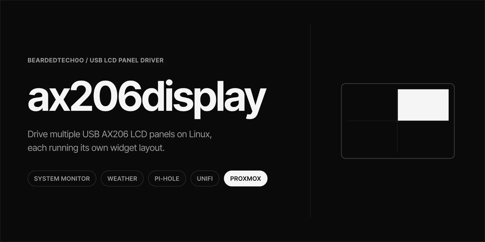
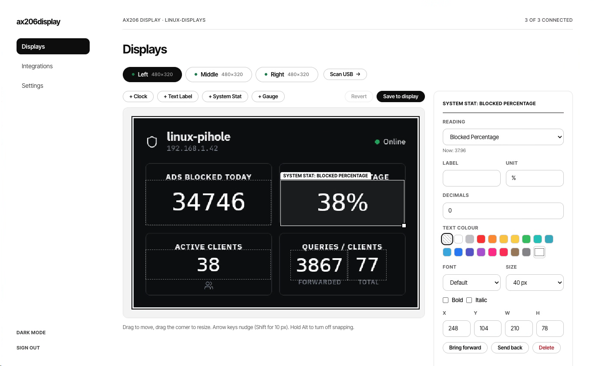
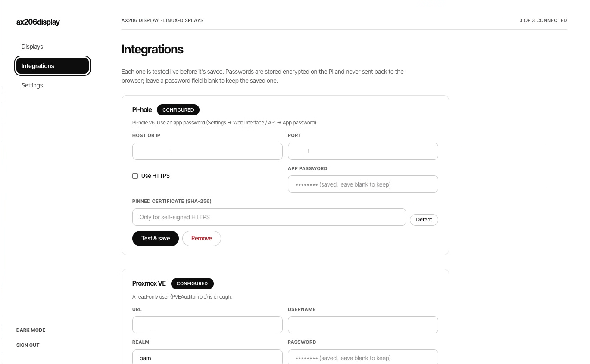
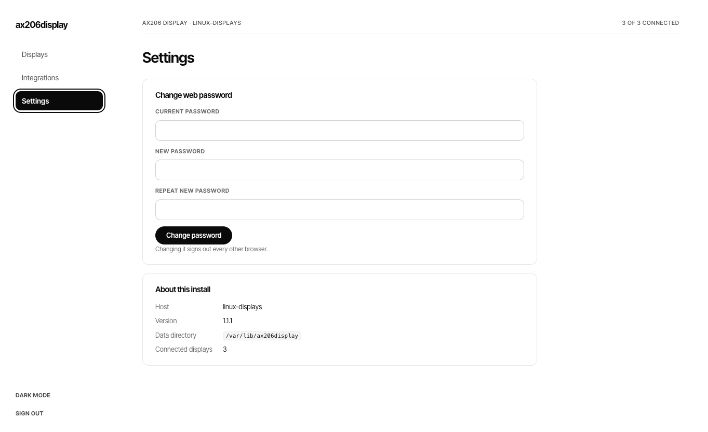

# ax206display

Drives multiple USB AX206-based LCD screens (the common 3.5" 480x320 "USB
LCD monitor" panels and similar), each with its own independently configured
widget layout: system monitoring, images/GIFs, a clock, weather (Open-Meteo),
Pi-hole, UniFi, and Proxmox status.

It runs two ways:

- **Windows:** a system-tray app with a desktop Widget Designer.
- **Linux / Raspberry Pi:** a background service you manage from a web page
  in any browser on your network. See
  [`docs/raspberry-pi.md`](docs/raspberry-pi.md).

The AX206 USB protocol is not publicly documented by its vendor; this project
reverse-derives it from public reference implementations - see
[`docs/protocol-spec.md`](docs/protocol-spec.md) for the full write-up,
citations, and known gaps.

## Download

Everything is on the [Releases page](https://github.com/BeardedTech0o/ax206display/releases).
Every release has a Windows and a Linux version. Neither needs .NET installed
separately.

| You're running | Download | Then |
|---|---|---|
| Windows 10/11 (install it) | `Ax206Display-<version>-win-x64.msi` | Run it. Adds a Start Menu shortcut and upgrades cleanly next time. |
| Windows 10/11 (portable) | `Ax206Display-<version>-win-x64.zip` | Unzip and run `Ax206Display.exe`. Keep `libusb-1.0.dll` next to it. |
| Raspberry Pi OS 64-bit (Pi 3, 4, 5, Zero 2 W) | `ax206display-<version>-linux-arm64.tar.gz` | Unpack and run `sudo ./install.sh`. |
| Raspberry Pi OS 32-bit | `ax206display-<version>-linux-arm.tar.gz` | Same as above. |
| Other Linux PC (x64) | `ax206display-<version>-linux-x64.tar.gz` | Same as above. |

Not sure which Pi build? Run `dpkg --print-architecture` on the Pi: `arm64`
means the 64-bit one, `armhf` the 32-bit one. Each file has a matching
`.sha256` checksum.

The Pi setup, from a blank SD card to a working screen, is in
[`docs/raspberry-pi.md`](docs/raspberry-pi.md).

## Status

The Windows app has shipped since v1.0.0: multiple displays, the Widget
Designer, clock, text, stat and gauge widgets, backgrounds, and Pi-hole,
UniFi and Proxmox integrations.

The Linux/Raspberry Pi service is new in v1.1.0. It covers the same widgets
and integrations through a web UI and has been tested under emulation and in
CI, but not yet on a wide range of Pi hardware. Reports welcome.

## The web UI (Linux)

Open `http://<your-pi>:8206` from any browser on your network.

**Displays.** One tab per screen, with a green dot when it's connected. Drag
widgets around the live preview, then press **Save to display**.



**Integrations.** Set up Pi-hole, Proxmox and UniFi. Each one is tested against
the live service before it's saved, and passwords are never sent back to the
browser.



**Settings.** Change the web password and check which version is running.



## Solution layout

| Project | TFM | Purpose |
|---|---|---|
| `Ax206Display.Protocol` | net10.0 | AX206 command/CBW/CSW byte-level protocol, no I/O |
| `Ax206Display.Transport` | net10.0 | `IAx206Transport` + a mock, a LibUsbDotNet-based transport, and a WinUSB P/Invoke fallback |
| `Ax206Display.Rendering` | net10.0 | SkiaSharp-based widget compositor and pixel-format conversion |
| `Ax206Display.DataSources` | net10.0 | System sensors (LibreHardwareMonitorLib on Windows, `/proc` and `/sys` on Linux), Open-Meteo weather, Pi-hole, UniFi, Proxmox clients |
| `Ax206Display.Config` | net10.0 | JSON config models/service; secret store backed by DPAPI on Windows, an AES-GCM key file elsewhere |
| `Ax206Display.Engine` | net10.0 | What both front ends share: the device supervisor, data pump services, widget catalog, integration setup, and one DI registration (`AddAx206DisplayCore`) that picks the right platform pieces |
| `Ax206Display.App` | net10.0-windows | The WPF tray app: tray icon/menu, Task Scheduler auto-start, widget-designer window |
| `Ax206Display.Server` | net10.0 | The Linux service: ASP.NET Core host with the web UI (`wwwroot`, no build step), cookie login, systemd integration |
| `Ax206Display.Tests` | net10.0 | xUnit tests for every project above except `App` |

All USB I/O goes through the `IAx206Transport` interface so
rendering/config/data-source code is fully testable without hardware (see
`Ax206Display.Transport.Mock`). Device discovery never hardcodes a USB
VID/PID: it probes candidate devices with the protocol's own
`GetLcdParameters` command and accepts whichever respond plausibly.

## Building

Requires the [.NET 10 SDK](https://dotnet.microsoft.com/download/dotnet/10.0).

```sh
# Everything except the WPF app, including the Linux server (works on Linux/macOS/Windows):
dotnet build Ax206Display.CrossPlatform.slnf
dotnet test Ax206Display.CrossPlatform.slnf

# Everything, including the WPF app (Windows only):
dotnet build Ax206Display.sln

# A Linux release tarball (any OS with the SDK; cross-builds for ARM fine):
packaging/linux/build-release.sh linux-arm64 1.0.0
```

CI (`.github/workflows/ci.yml`) mirrors this split: a Linux job builds and
tests the cross-platform projects and test-publishes the Raspberry Pi
tarball, and a `windows-latest` job builds the full solution including the
WPF app.

Releases come from `.github/workflows/release.yml`. Run it from the Actions
tab with a tag like `v1.2.0` (or push that tag): it builds the signed Windows
MSI and zip, then the three Linux tarballs, and attaches all of them to one
GitHub release.

## Security

TLS to UniFi/Proxmox uses certificate pinning
(`IntegrationConfig.PinnedCertificateSha256Thumbprint`), not a blanket
"accept any certificate" bypass, since both commonly serve self-signed
certs on a LAN. Secrets are DPAPI-encrypted at rest on Windows and
AES-256-GCM-encrypted with an owner-only key file on Linux
(`Ax206Display.Config.Secrets`), and their in-memory buffers are zeroed after
use. The Linux service's web login, sandboxing and network exposure are
covered in [`docs/raspberry-pi.md`](docs/raspberry-pi.md#security-notes).
The Windows app currently runs elevated (`requireAdministrator`) for USB/Task Scheduler access; see
[`docs/privilege-separation.md`](docs/privilege-separation.md) for a proposed
design to shrink that to a minimal elevated broker process in a future
milestone.

UniFi login needs a **local-access-only** admin account - a cloud/SSO-linked
account can fail to authenticate through the API in confusing ways (e.g. a
generic "invalid credentials" response even with the right password) that
have nothing to do with this app. If Test & Save keeps failing, check
Settings &rarr; Admins &rarr; the account in question and confirm it's set to
local access rather than linked to a Ubiquiti cloud account. If you'd rather
keep 2FA enabled on that account instead of switching it to local-only, the
app supports that too (`IntegrationConfig.TotpSecretKey`, computed via
`Ax206Display.DataSources.Auth.TotpGenerator`) - enter the base32 setup
key/secret from when you enabled 2FA, not a live 6-digit code.

The build enforces `TreatWarningsAsErrors` with
`AnalysisLevel=latest-recommended`, pins the full dependency graph via
`packages.lock.json` + `Directory.Packages.props`, and gates CI on
`NuGetAudit`/`dotnet list package --vulnerable`.

[](https://www.buymeacoffee.com/nullobj)
